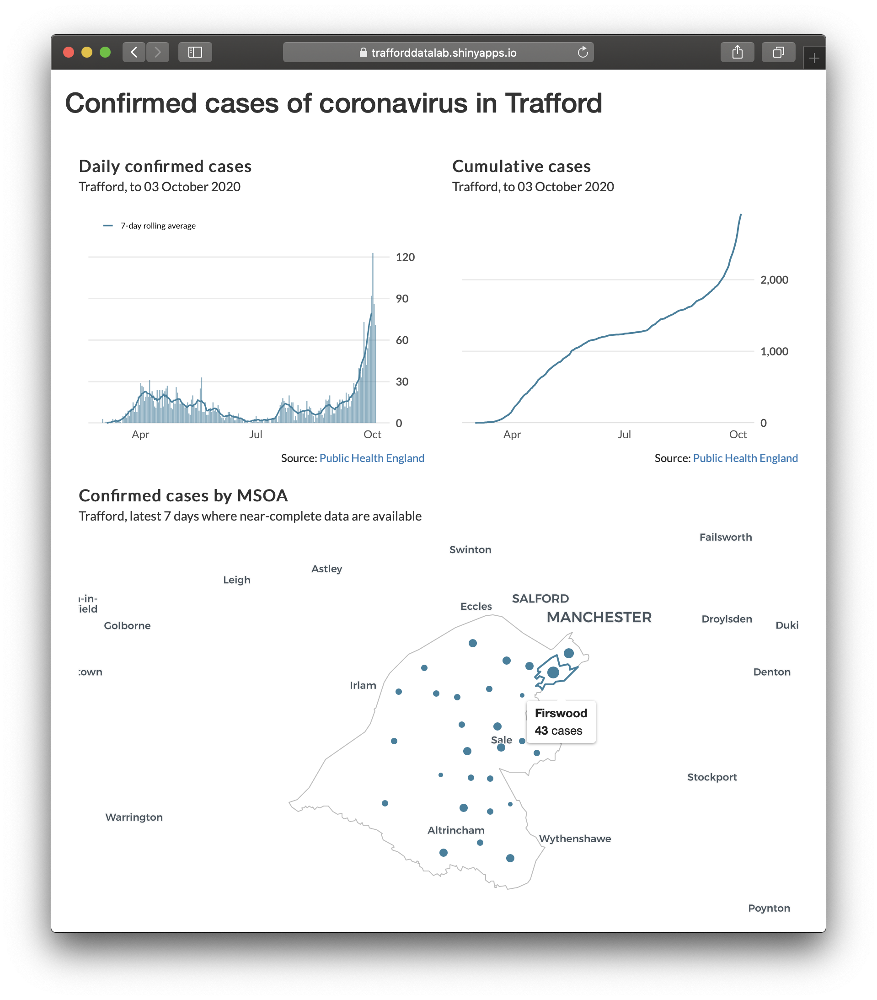

<h3>trafford_COVID-19</h3>

Data visualisations and analysis relating to confirmed cases of coronavirus in Trafford.

    <strong>Data sources</strong>
    <ul>
        <li><a href="https://coronavirus.data.gov.uk" target="_blank">Public Health England</a></li>
    </ul>
<strong>Credits</strong>

This application was built by the <a href="https://www.trafforddatalab.io" target="_blank">Trafford Data Lab</a> in <a href="https://cran.r-project.org" target="_blank">R</a> using the <a href="https://cran.r-project.org/web/packages/shiny/index.html" target="_blank">shiny</a>, <a href="https://cran.r-project.org/web/packages/reactable/index.html" target="_blank">reactable</a> and <a href="https://cran.r-project.org/web/packages/ggplot2/index.html" target="_blank">ggplot2</a> packages.

